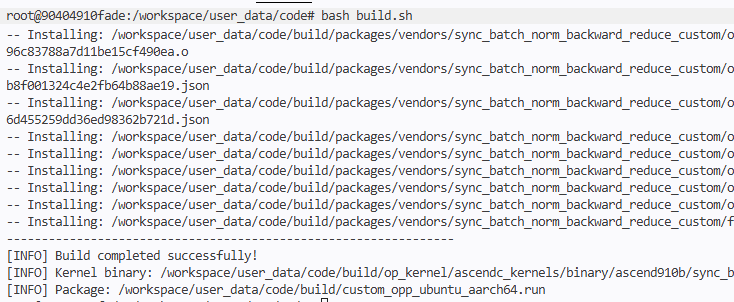
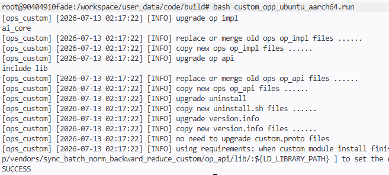
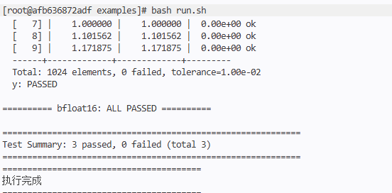

# SyncBatchNormBackwardReduce 算子使用指导

## 1. 算子概述

### 1.1 功能描述

SyncBatchNormBackwardReduce 算子用于 SyncBatchNorm（同步批归一化）反向传播的归约计算阶段。该算子接收四路输入张量，通过乘法、减法、乘法三步运算，输出中间梯度 `sum_dy_xmu` 和最终梯度 `y`。

### 1.2 计算公式

```
dy_mean      = mean * sum_dy              (Mul)
sum_dy_xmu   = sum_dy_dx_pad - dy_mean    (Sub)
y            = sum_dy_xmu * invert_std    (Mul)
```

对于 FLOAT16/BF16 类型，输入先 Cast 到 FLOAT32 进行计算，再 Cast 回原数据类型（RoundMode: CAST_RINT），以保证计算精度。

### 1.3 应用场景

该算子是 SyncBatchNorm 反向传播链路中的核心组件，用于在多卡同步场景下计算输入梯度。通常位于 `SyncBatchNormBackwardReduce` → `SyncBatchNormBackwardElemt` 的计算链路中。

## 2. 环境要求

### 2.1 硬件要求

| 产品 | 支持状态 |
|------|---------|
| Atlas A2 训练系列产品/Atlas A2 推理系列产品 | 支持 |
| Atlas A3 训练系列产品/Atlas A3 推理系列产品 | 支持 |

### 2.2 软件依赖

- CANN 版本：8.5.0 及以上
- Ascend C 算子开发框架
- 操作系统：Linux (Ubuntu 22.04 / EulerOS 2.0)
- 编译工具：CMake 3.5+, GCC 7.5+

## 3. 算子编译与安装

### 3.1 编译

```bash
# 进入算子代码目录
cd code/

# 编译算子包
bash build.sh
```

编译成功后，将在 `build/` 目录下直接生成解压后的算子安装文件，包括 `custom_opp_ubuntu_aarch64.run` 安装脚本及相关产物。



### 3.2 安装

```bash
# 进入 build 目录，运行安装脚本
cd build/
bash custom_opp_ubuntu_aarch64.run
```

安装完成后，算子将部署到 `/usr/local/Ascend/cann-9.0.0/opp/vendors/sync_batch_norm_backward_reduce_custom/` 目录下。



### 3.3 配置环境变量

安装后需要将自定义算子的 op_api 库路径添加到 `LD_LIBRARY_PATH`，否则调用算子时会找不到动态库：

```bash
export LD_LIBRARY_PATH=/usr/local/Ascend/cann-9.0.0/opp/vendors/sync_batch_norm_backward_reduce_custom/op_api/lib/:${LD_LIBRARY_PATH}
```

建议将此命令写入 `~/.bashrc` 以持久化配置：

```bash
echo 'export LD_LIBRARY_PATH=/usr/local/Ascend/cann-9.0.0/opp/vendors/sync_batch_norm_backward_reduce_custom/op_api/lib/:${LD_LIBRARY_PATH}' >> ~/.bashrc
source ~/.bashrc
```

### 3.4 验证安装

安装并配置环境变量后，可通过运行 aclnn 调用示例验证算子是否正常工作：

```bash
cd code/examples/
bash run.sh float16
```

如果输出 `PASSED` 则说明算子已正确安装并可正常调用。



## 4. 算子调用方法

### 4.1 aclnn API 调用流程

算子采用 aclnn 两段式调用接口：

1. **第一段**：调用 `aclnnSyncBatchNormBackwardReduceGetWorkspaceSize` 获取 workspace 大小
2. **第二段**：调用 `aclnnSyncBatchNormBackwardReduce` 执行算子

### 4.2 完整调用示例

```cpp
#include <iostream>
#include <vector>
#include "acl/acl.h"
#include "aclnn_sync_batch_norm_backward_reduce.h"

int main() {
    // 1. 初始化 ACL
    aclInit(nullptr);
    aclrtStream stream;
    aclrtSetDevice(0);
    aclrtCreateStream(&stream);

    // 2. 构造输入输出 (以 float16, shape={1024} 为例)
    std::vector<int64_t> shape = {1024};
    int64_t elemCount = 1024;
    aclDataType dtype = ACL_FLOAT16;

    // 创建输入 tensor: sum_dy, sum_dy_dx_pad, mean, invert_std
    // 创建输出 tensor: sum_dy_xmu, y
    // (使用 aclCreateTensor 和 aclrtMalloc 创建，详见 examples/ 目录)

    // 3. 获取 workspace 大小
    uint64_t workspaceSize = 0;
    aclOpExecutor* executor = nullptr;
    aclnnSyncBatchNormBackwardReduceGetWorkspaceSize(
        sum_dy, sum_dy_dx_pad, mean, invert_std,
        sum_dy_xmu, y, &workspaceSize, &executor);

    // 4. 申请 workspace
    void* workspace = nullptr;
    if (workspaceSize > 0) {
        aclrtMalloc(&workspace, workspaceSize, ACL_MEM_MALLOC_HUGE_FIRST);
    }

    // 5. 执行算子
    aclnnSyncBatchNormBackwardReduce(workspace, workspaceSize, executor, stream);

    // 6. 同步等待
    aclrtSynchronizeStream(stream);

    // 7. 读取结果 (从 Device 拷贝到 Host)
    // ...

    // 8. 释放资源
    aclrtDestroyStream(stream);
    aclrtResetDevice(0);
    aclFinalize();
    return 0;
}
```

完整的可运行示例请参考 `code/examples/test_aclnn_sync_batch_norm_backward_reduce.cpp`。

### 4.3 运行示例

```bash
# 编译并运行示例 (需要 NPU 环境)
cd code/examples/
bash run.sh              # 测试所有 dtype
bash run.sh float16      # 仅测试 float16
bash run.sh float32      # 仅测试 float32
bash run.sh bfloat16     # 仅测试 bfloat16
```

## 5. 输入输出说明

### 5.1 输入参数

| 参数名 | 数据类型 | 数据格式 | 说明 |
|--------|---------|---------|------|
| sum_dy | BF16, FLOAT16, FLOAT | ND | dy 的归约和 |
| sum_dy_dx_pad | BF16, FLOAT16, FLOAT | ND | dy*dx 的归约和（已 pad 对齐） |
| mean | BF16, FLOAT16, FLOAT | ND | 前向传播保存的均值 |
| invert_std | BF16, FLOAT16, FLOAT | ND | 标准差的倒数 |

### 5.2 输出参数

| 参数名 | 数据类型 | 数据格式 | 说明 |
|--------|---------|---------|------|
| sum_dy_xmu | BF16, FLOAT16, FLOAT | ND | sum_dy_dx_pad - mean*sum_dy |
| y | BF16, FLOAT16, FLOAT | ND | sum_dy_xmu * invert_std |

## 6. 注意事项

1. 四路输入的 shape 必须完全相同，否则算子行为未定义。
2. 输出 shape 与输入 shape 相同。
3. 支持 ND（任意维度）格式。
4. 当输入元素总数小于 1024 时，算子使用单核处理；大于等于 1024 时启用多核并行。
5. FLOAT16/BF16 类型的计算在 FLOAT32 下进行中间运算，确保精度。
6. 算子内部处理了 32 字节对齐的 pad 逻辑，用户无需手动对齐。
