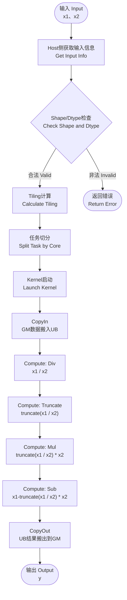
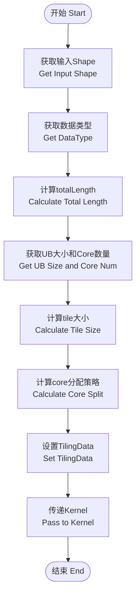
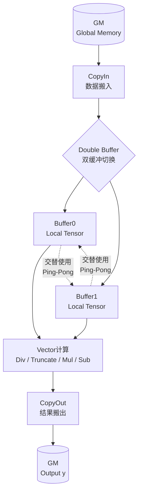
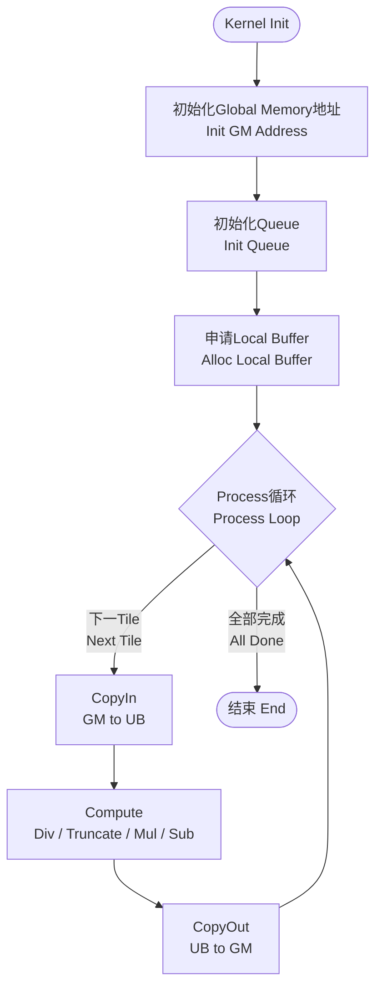
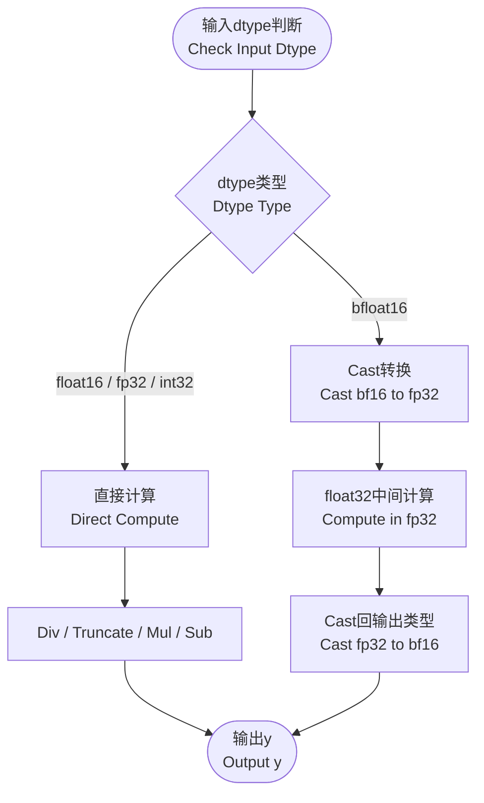

# 1 需求背景（required）

## 1.1 需求来源

基于TruncateMod算子历史TBE版本使用Ascend C编程语言进行优化。TruncateMod算子作为逐元素数学计算类算子，主要用于实现截断取余语义，要求在Ascend A2系列硬件上提供与既有TBE实现一致的功能、精度和调用方式，并通过Ascend C编程模型提升多核并行效率和UB利用率。

本需求面向ACLNN直调和图模式调用场景，算子输入为x1、x2两个Tensor，输出为y。算子不引入额外属性，计算结果由输入数据类型和逐元素数学表达式决定。需求交付范围包含算子原型、shape适配、host侧tiling、kernel侧计算实现、精度验证、性能验证以及与TBE版本能力对齐分析。

TruncateMod算子（TBE）实现路径和相关API路径

TruncateMod算子实现路径为：/usr/local/Ascend/ascend-toolkit/latest/opp/built-in/op_impl/ai_core/tbe/impl

TruncateMod算子实现中的API路径：/usr/local/Ascend/ascend-toolkit/latest/python/site-packages/tbe/dsl

## 1.2 背景介绍

TruncateMod数学定义为：y = truncate(x1 / x2) * x2 - x1。其中truncate表示向0方向截断取整，x1、x2为输入Tensor，y为输出Tensor。该定义与普通求余表达式在符号处理上存在差异，关键点在于商的取整方向固定为向0截断，因此需要在除法后显式执行truncate操作，再通过乘法和减法得到输出。

参考TBE实现，TruncateMod算子的计算流程为：输入x1、x2，执行除法x1/x2，执行truncate操作，执行乘法truncate(x1/x2)*x2，执行减法result-x1，最终输出y。Ascend C实现需要对上述计算链路进行kernel侧向量化表达，并在host侧完成tiling数据准备，使不同输入规模下均可稳定映射到AI Core并行执行。

### 1.2.1 TruncateMod算子实现优化

TruncateMod算子属于典型二输入一输出逐元素计算算子，计算链路由Div、Truncate、Mul、Sub四类基础向量操作构成。相较TBE DSL实现，Ascend C实现可在kernel侧显式控制GM到UB的数据搬运、tile切分、Double Buffer开关和尾块处理策略，从而减少通用调度开销，提高小算子和中等规模张量场景下的执行效率。

优化目标是在保持TBE版本语义一致的前提下，将输入Tensor按照一维连续数据流处理，host侧基于输出元素总数totalLength和平台AI Core数量动态决定coreNum，并将任务均分到多个AI Core。kernel侧按tile循环执行CopyIn、Compute、CopyOut，尽量以批量DataCopy方式完成GM与UB之间的数据交换，避免频繁小粒度搬运。

对于float16、float32、int32等类型，优先使用Ascend C对应向量API执行计算；对于bfloat16场景，考虑硬件API对bf16直接参与Div、Truncate等操作的支持情况，采用必要的Cast转换到float32进行中间计算，再Cast回bfloat16输出，保证计算链路可实现且精度不低于TBE版本。

### 1.2.2 TruncateMod算子现状分析

通过对TruncateMod算子TBE版本的功能分析，当前支持的能力如下：

1. x1、x2为二输入Tensor，y为输出Tensor，输入输出数据类型保持一致，format以ND为主。
2. 算子核心计算表达式为y = truncate(x1 / x2) * x2 - x1，计算过程中需要同时关注除法、截断取整、乘法、减法四个阶段的dtype行为。
3. TBE实现按照DSL计算图表达逐元素流程，依赖框架完成shape、dtype校验以及通用调度，Ascend C实现需将上述逻辑拆分为host侧tiling和kernel侧向量计算。
4. 若输入shape完全一致，算子可按连续一维向量处理；若需要广播，需要额外进行shape补齐和地址映射。基于本设计约束，当前优先覆盖同shape和可连续处理场景，不支持复杂广播。
5. 除数x2为0时数学定义无效，算子调用侧应保证x2中不存在0值；工程实现不针对除零场景提供额外容错语义。
TruncateMod算子TBE版本的整体流程可抽象为下述计算链路：

# 2 需求分析

## 2.1 外部组件依赖

不涉及新增外部组件依赖。算子依赖CANN算子开发基础组件，包括算子原型注册、shape推导、tiling上下文、平台信息查询、Ascend C kernel API、ACLNN调用框架和图模式执行框架。上述依赖均属于CANN标准算子开发链路，不引入第三方算法库或运行时组件。

| 上层框架 | 涉及的框架勾选 | 说明 |
| --- | --- | --- |
| TF训练/推理 |  | 不作为本需求主要验证入口 |
| Pytorch训练/推理 |  | 通过上层适配可间接调用 |
| ATC推理 | √ | 支持图模式编译和推理场景 |
| Aclnn直调 | √ | 支持ACLNN接口直接调用 |
| OPAT调优 |  | 不作为本阶段强制依赖 |
| SGAT子图切分 |  | 不涉及子图切分特性 |

## 2.2 内部适配模块

内部适配模块包括op_proto算子原型定义、infer shape模块、tiling模块和Ascend C kernel模块。op_proto用于声明输入输出个数、dtype、format和动态shape支持能力；infer shape模块用于校验输入shape并推导输出shape；tiling模块用于根据平台资源和输入规模生成kernel执行参数；kernel模块用于完成GM与UB之间的数据搬运和逐元素计算。

TruncateMod不包含属性输入，host侧需要从上下文中获取x1、x2的shape、dtype和format信息，并将输出元素总数、每核数据量、tileSize、尾块大小、是否启用Double Buffer等信息写入tiling data。kernel侧仅读取tiling data和GM地址，不进行复杂元信息推导，以降低device侧控制开销。

| 模块 | 职责 | 关键输出 |
| --- | --- | --- |
| 算子原型 | 声明x1、x2、y的dtype、format、shape能力 | 原型注册信息 |
| Shape推导 | 校验输入shape一致性并设置输出shape | y shape |
| Tiling | 计算coreNum、blockLength、tileSize、tail信息和tilingKey | TruncateModTilingData |
| Kernel | 执行CopyIn、Div、Truncate、Mul、Sub、CopyOut | 输出Tensor y |

## 2.3 需求模块设计

需求模块设计遵循Ascend C自定义算子开发规范，host侧和kernel侧职责清晰分离。host侧负责静态信息解析和执行参数计算，kernel侧负责高吞吐数据处理。TruncateMod计算过程中需要多个中间Tensor，因此UB空间规划需要同时考虑输入x1、输入x2、除法结果、截断结果、乘法结果和输出结果的存放需求，避免tileSize设置过大导致UB溢出。

### 2.3.1 算子原型

原型设计

| 名称 | 类别 | dtype | format | shape | 介绍 |
| --- | --- | --- | --- | --- | --- |
| x1 | 输入 | float16/float32/int32/bfloat16 | ND | 动态shape | 被除数输入Tensor |
| x2 | 输入 | float16/float32/int32/bfloat16 | ND | 动态shape | 除数输入Tensor |
| y | 输出 | 同输入 | ND | 同输入 | 输出Tensor |

输入x1与x2需要使用相同dtype，输出y的dtype与输入保持一致。float16和float32可用于浮点截断取余场景；int32用于整型截断取余场景；bfloat16根据Ascend C硬件能力采用Cast到float32中间计算后回写bfloat16的方式支持。format为ND，shape支持动态shape，host侧在运行时根据实际输入shape计算totalLength和tiling参数。

相关约束

- x1、x2、y均为Tensor输入输出，不包含标量属性。
- x1、x2需要shape一致；若参考实现不支持复杂广播，本设计不对复杂广播进行支持。
- 输入format为ND，输出format为ND，不支持分形格式或私有格式。
- x2中元素不能为0，调用侧应保证除数合法。
- 动态shape场景下需要在tiling阶段能够获取输出元素总数，否则返回失败。
# 3 需求详细设计

## 3.1 使能方式

通过算子原型注册使能TruncateMod算子，声明输入x1、x2和输出y的dtype、format及动态shape能力；通过shape推导函数完成输出shape设置；通过tiling函数完成host侧切分参数计算；通过Ascend C kernel入口完成AI Core侧计算。上层可通过图模式编译或ACLNN直调方式触发该算子执行。

算子使能后，框架在编译或执行阶段根据输入Tensor信息调用host侧tiling。tiling结果随kernel启动参数下发至device侧，kernel根据blockIdx确定当前AI Core负责的数据范围，并按照tile循环处理。该设计不依赖workspace，临时数据优先放置在UB中。

| 使能项 | 设计说明 |
| --- | --- |
| 算子注册 | 注册TruncateMod算子名称、输入输出、dtype、format和动态shape能力。 |
| Shape推导 | 根据输入x1、x2 shape设置输出y shape，非法shape直接返回失败。 |
| Tiling注册 | 注册host侧tiling函数，生成blockDim、tileSize、core分配和tilingKey。 |
| Kernel注册 | 注册Ascend C kernel入口，按照tilingKey选择普通路径或dtype转换路径。 |

## 3.2 需求总体设计

TruncateMod整体设计分为host侧设计和kernel侧设计。host侧负责获取输入shape、dtype和平台资源，计算totalLength、coreNum、每核处理长度、tileSize、尾块信息及tilingKey；kernel侧负责根据tiling data执行Init和Process，其中Process包含CopyIn、Compute、CopyOut三个阶段。

### 3.2.1 host侧设计

tiling策略：

Host侧首先从TilingContext中获取输入x1、x2的shape信息，校验输入维度和元素个数是否满足算子约束。对于不支持复杂广播的实现，要求x1、x2 shape完全一致；对于动态shape，运行时以实际shape计算输出元素总数totalLength。若totalLength为0，tiling返回空计算参数并避免启动无效大规模任务。

Host侧获取输入数据类型dtype，并根据dtype确定元素字节数、kernel模板路径和中间计算策略。float16、float32、int32按照普通计算路径处理；bfloat16由于部分Ascend C API对bf16直接参与Div或Truncate存在限制，host侧可通过tilingKey标识特殊dtype转换路径，kernel侧将bf16转换为float32完成计算后再Cast输出。

根据输入规模动态决定coreNum。coreNum优先不超过平台可用AI Core数量，同时需要避免小shape场景下使用过多核导致单核数据量过小。设计上按totalLength和基础Block大小计算建议使用核数，usedCoreNum = min(maxCoreNum, ceil(totalLength / blockSize))，并保证至少使用1个核。blockDim设置为usedCoreNum，使任务均分到多个AI Core。

tiling data中需要保存totalLength、usedCoreNum、每核基础处理长度、余数长度、tileSize、tileNum、tailSize、dtype标识和是否启用Double Buffer等字段。kernel侧根据blockIdx和这些参数即可计算本核的GM起始offset和处理长度，不再重复解析shape。

分核策略：

分核采用优先使用满核原则。当输入长度足够大时，尽量使用平台可用AI Core参与计算，以提升并行度；当输入长度较小时，根据最小有效Block大小减少实际使用核数，避免核间调度开销大于计算收益。每个AI Core处理连续的一段输出数据，便于GM连续搬运和UB内向量计算。

根据输入长度totalLength和Block大小计算每个核处理的数据量。若totalLength可以被usedCoreNum整除，则每个核处理的数据量一致；若不能整除，将余数分配给前几个核。设baseLen = totalLength / usedCoreNum，remain = totalLength % usedCoreNum，则blockIdx < remain的核处理baseLen + 1个元素，其余核处理baseLen个元素。

上述策略可保证任意两个核之间的数据量差异不超过1个元素，适合逐元素计算类算子的负载均衡要求。对于按Block对齐搬运的实现，可将baseLen向BlockSize对齐，并将非对齐尾部作为tail处理；前若干核承担余数Block，保证尾部数据不遗漏。

数据分块和UB优化策略：

Host侧通过平台信息获取UB大小，并结合输入输出Tensor数量、中间Tensor数量、dtype长度和Double Buffer开关计算tileSize。TruncateMod至少需要x1、x2两个输入buffer、除法结果buffer、截断结果buffer、乘法结果buffer以及输出buffer。若中间结果可复用同一LocalTensor空间，可适当降低UB占用，但必须避免读写覆盖导致计算错误。

tileSize按照UB可用空间除以单元素综合占用计算，并向Block对齐。对于float32和bf16转换路径，由于中间计算使用float32，tileSize需要按float32临时buffer占用估算；对于float16路径，可在满足API输入要求的前提下使用half类型中间buffer，提高单次tile处理元素数；对于int32路径，需要考虑Div和Truncate语义的实现方式，必要时同样使用float32临时计算。

支持Double Buffer。大输入场景下启用Double Buffer，使当前tile计算与下一tile搬入/上一tile搬出形成流水，提高AI Core利用率；小输入或UB压力较大场景可关闭Double Buffer，减少队列和buffer数量。host侧根据tileSize、单核处理长度和UB剩余空间动态设置BUFFER_NUM。

数据搬运采用批量Copy策略，GM到UB和UB到GM尽量使用连续DataCopy，减少搬运次数。尾块处理时，最后一个tile的有效元素数可能小于tileSize，kernel侧依据actualTileLength执行DataCopyPad或带mask计算，确保尾部不读写越界。

tilingKey规划策略：

tilingKey用于标识kernel侧不同计算路径。普通float16、float32、int32同shape连续场景可使用tilingKey=0，kernel按标准CopyIn、Div、Truncate、Mul、Sub、CopyOut流程执行；bfloat16或需要中间Cast转换的场景可使用tilingKey=1，kernel在Compute前后插入Cast逻辑。

| tilingKey | 适用场景 | kernel路径 |
| --- | --- | --- |
| 0 | float16、float32、int32普通连续计算 | 普通计算路径 |
| 1 | bfloat16或需要特殊dtype转换场景 | Cast到float32中间计算后Cast输出 |

若后续扩展复杂广播、不同format或更多dtype，可继续扩展tilingKey编码。当前设计保持tilingKey含义简单，避免kernel入口分支过多影响维护性。

### 3.2.2 kernel侧设计

Kernel侧采用Init和Process两个阶段。Init阶段根据输入GM地址、输出GM地址和tiling data完成全局内存地址初始化，计算当前blockIdx对应的数据偏移和处理长度，并初始化输入输出Queue、临时Buffer和Pipe对象。Process阶段循环处理本核负责的数据，每个tile依次执行CopyIn、Compute、CopyOut。

Init阶段：

- 初始化Global Memory地址，包括x1GM、x2GM和yGM，并根据blockOffset偏移到当前AI Core负责的数据起点。
- 初始化Queue，分别用于输入x1、输入x2和输出y的LocalTensor申请与释放。
- 初始化Buffer，为Div结果、Truncate结果、Mul结果以及必要的Cast临时结果分配UB空间。
- 读取tiling data中的blockLength、tileSize、tailSize、dtype标识和Double Buffer标识，确定Process循环次数。
Process阶段：

CopyIn：从GM搬入当前tile的x1和x2数据到Local Memory。普通连续场景使用批量DataCopy或DataCopyPad完成搬运；尾块按照actualTileLength处理，避免读取越界。若Double Buffer开启，CopyIn使用循环队列与Compute/CopyOut形成流水。

Compute：按表达式顺序执行Div(x1, x2)、Truncate()、Mul(truncateResult, x2)、Sub(mulResult, x1)。float32路径中间结果保持float32；float16路径可直接使用half计算或在精度要求下转换为float32计算；int32路径根据Ascend C API支持情况可转换为float32执行除法和truncate，再转换回int32输出；bfloat16路径建议Cast到float32完成全流程计算，最后Cast回bfloat16。

CopyOut：将Compute得到的结果从Local Memory搬回输出GM。输出dtype必须与输入dtype一致，bfloat16和float16路径在CopyOut前完成Cast输出；尾块仅搬出有效元素，确保不会覆盖输出Tensor边界外内存。

float16/fp32/int32计算流程：float32作为基础高精度路径，可直接执行除法、截断、乘法和减法；float16场景在API支持时直接以half执行，若truncate精度或API限制不满足要求，可将中间结果提升到float32；int32场景需要保持截断语义，除法阶段可转为float32后truncate，再按输出要求转换为int32。所有路径均需与TBE版本输出进行精度对齐。

bfloat16计算流程：由于bf16表示范围和精度特性不同，且部分硬件对bf16数学API支持有限，kernel侧将bf16输入Cast为float32，按float32完成Div、Truncate、Mul、Sub，再Cast回bf16输出。host侧通过tilingKey=1选择该路径，并在不支持bf16 Cast的硬件上返回能力不支持错误。

## 3.3 支持硬件

| 支持的芯片版本 | 涉及勾选 | 支持类型 |
| --- | --- | --- |
| 香橙派OrangePi AIpro |  | 不作为本需求验证范围 |
| Atlas 200I/500 A2推理产品 |  | 不作为本需求验证范围 |
| Atlas 800I/T A2 | √ | float16、float32、int32、bfloat16 |

本设计面向Ascend A2系列硬件，支持Atlas 800I/T A2。float16、float32、int32为主要验证类型，bfloat16根据硬件Cast能力和Ascend C API支持情况使能。若目标硬件不支持bfloat16到float32或float32到bfloat16的Cast能力，应在host侧tiling或能力校验阶段返回不支持，避免kernel运行时异常。

## 3.4 算子约束限制

- 输入x1、x2的shape需要一致；当前设计不支持复杂广播，若参考实现或后续需求要求广播，应新增shape补齐、输出shape推导和kernel地址映射逻辑。
- 输入x1、x2的dtype需要一致，输出y的dtype与输入一致。
- 输入format为ND，当前不支持NC1HWC0、FRACTAL_NZ等特殊format。
- x2不能为0。除零会导致数学定义无效，浮点场景可能产生Inf或NaN，整型场景可能产生未定义结果。
- 动态shape场景下，host侧需要能够获取实际输入元素数；若shape中存在未知维且无法推导totalLength，则不下发kernel。
- bfloat16路径依赖Cast能力，若目标硬件或软件版本不支持相关Cast接口，则该dtype返回不支持。
- 为保证性能，输入数据建议连续存储；非连续Tensor由上层框架通过AutoContiguous或等效机制处理。
# 4 特性交叉分析

TruncateMod算子与动态shape、ACLNN直调、图模式编译、多核并行、dtype转换和精度验收等特性存在交叉。动态shape场景要求tiling在运行时根据实际shape计算totalLength和分核信息；ACLNN直调要求原型、infer shape和tiling链路完整可用；图模式编译要求算子注册信息稳定，输出shape推导结果满足后续图优化和内存规划要求。

多核并行与UB切分存在交叉影响。使用更多AI Core可以提升大Tensor吞吐，但会降低单核处理数据量，增加尾块比例和调度开销；tileSize增大可减少GM与UB之间搬运次数，但会增加UB占用并可能影响Double Buffer启用。因此host侧需要综合totalLength、UB大小、dtype长度和中间Tensor数量进行切分。

bfloat16特性与精度、性能均存在交叉。Cast到float32能够提高中间计算稳定性并满足API支持，但会增加UB占用和Cast指令开销；直接bf16计算若硬件支持可提升性能，但需要额外验证与TBE版本精度一致性。本设计优先采用Cast到float32的稳妥路径，以精度和兼容性为优先。

| 交叉特性 | 影响分析 | 设计处理 |
| --- | --- | --- |
| 动态shape | 运行时输入规模变化影响coreNum和tileSize | host侧实时计算totalLength并生成tiling data |
| 多核并行 | 影响负载均衡和尾块比例 | 余数分配给前几个核，单核连续处理 |
| Double Buffer | 提升流水效率但增加UB占用 | 根据UB容量和tileSize动态使能 |
| bfloat16 | 需要Cast保障API支持和精度 | tilingKey选择特殊dtype转换路径 |
| 除零约束 | 影响数学定义和运行结果 | 约束x2不能为0，由调用侧保证 |

# 5 可维可测分析

## 5.1 精度标准/性能标准

精度标准：TruncateMod Ascend C版本精度不低于TBE版本。测试时以TBE实现或CPU参考实现作为golden，覆盖float16、float32、int32、bfloat16类型，以及正数、负数、混合符号、小数、边界值和尾块数据场景。由于truncate为向0方向截断，需重点验证负数输入下结果与floor类取余不同的场景。

性能标准：TruncateMod Ascend C版本性能不低于TBE版本。性能验证需覆盖小shape、中shape、大shape以及非整tile尾块场景，重点观察多核并行效率、UB利用率、Double Buffer收益、Tile切分合理性、GM与UB搬运次数以及尾块处理开销。对于bfloat16特殊路径，应单独评估Cast开销，并与TBE版本进行同dtype对比。

| 验收标准 | 描述(不涉及说明原因) | 标准来源 |
| --- | --- | --- |
| 精度标准 | 不低于TBE版本 | TruncateMod TBE基线 |
| 性能标准 | 不低于TBE版本 | TruncateMod TBE基线 |

可测性方面，host侧可通过tiling单元测试验证不同shape、dtype、totalLength下coreNum、blockLength、tileSize、tailSize和tilingKey是否符合预期；kernel侧可通过ACLNN直调用例验证输出正确性，并通过性能测试记录不同输入规模下的执行时间。尾块处理需要构造totalLength不能被tileSize和coreNum整除的用例，确保最后一个tile和前若干余数核均可正确输出。

## 5.2 兼容性分析

新算子基于Ascend C实现，外部可见接口与TruncateMod TBE版本保持一致，包括输入输出数量、dtype范围、format、动态shape能力和数学语义。对上层框架而言，算子名称、原型和输出shape推导规则不应发生不兼容变化。若后续扩展复杂广播，需要在兼容TBE广播规则的基础上补充校验逻辑。

兼容性风险主要包括：bfloat16路径在不同硬件或软件版本中的Cast能力差异；int32路径中除法和truncate语义与TBE版本是否完全一致；除零输入在不同后端的异常或特殊值表现；动态shape下totalLength为0或未知shape时的处理方式。上述风险需要通过CANN版本验证、硬件能力校验和精度回归测试进行控制。

总体上，TruncateMod Ascend C实现不改变算子调用接口，不引入额外属性，不依赖workspace和外部组件，具备与TBE版本平滑替换的条件。验收时应以TBE版本作为功能、精度和性能基线，确保新增实现满足工程交付要求。
