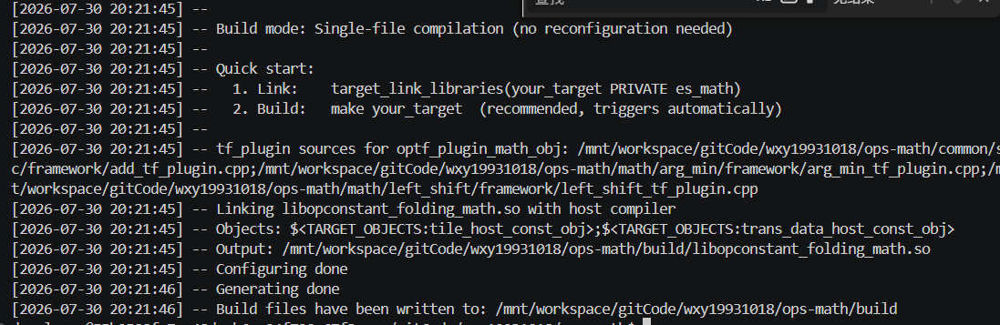
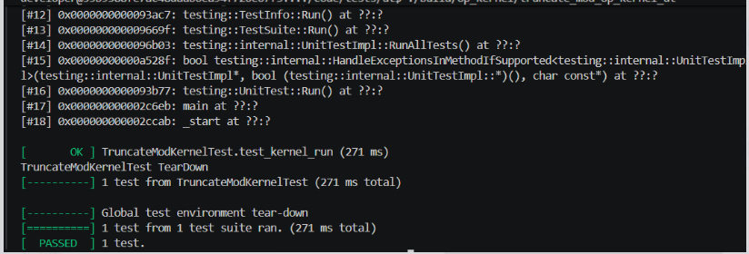
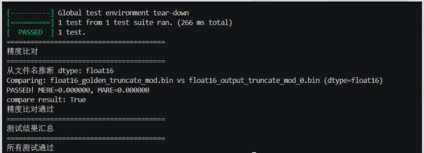

# TruncateMod

<!-- codespell:ignore infershape tiling bfloat -->


## 产品支持情况

<!-- npu="A3" id1 -->
- <term>Atlas A3 训练系列产品/Atlas A3 推理系列产品</term>：支持
<!-- end id1 -->
<!-- npu="910b" id2 -->
- <term>Atlas A2 训练系列产品/Atlas A2 推理系列产品</term>：支持
<!-- end id2 -->

本工程面向 `ascend910b`、`ascend910c` 和 `ascend910_93` 构建，源码中的算子实现文件为 `op_kernel/truncate_mod_apt.cpp`，host 侧定义和 tiling 文件位于 `op_host/` 目录。

## 功能说明

`TruncateMod` 完成逐元素截断取模计算，返回 `x1` 除以 `x2` 后基于截断除法得到的余数。该行为等价于 PyTorch 的 `torch.fmod(self, other)`，同时兼容 TensorFlow 的 `TruncateMod` 算子。

将输入 `x1` 和 `x2` 广播为相同 shape 后，计算公式如下：

$$
y_i = x1_i - trunc \left(\frac{x1_i}{x2_i}\right) \times x2_i
$$

其中，`trunc` 表示向 0 截断。`x2` 作为除数时不支持取值为 0。

## 算子原型

本工程提供 GE 算子原型和 GEIR 调用样例，不提供 `aclnn` 两段式接口。算子在 `op_graph/truncate_mod_proto.h` 中通过 `REG_OP(TruncateMod)` 注册，原型如下：

```c++
REG_OP(TruncateMod)
    .INPUT(x1, TensorType({DT_BF16, DT_FLOAT16, DT_FLOAT, DT_DOUBLE,
                           DT_INT64, DT_INT8, DT_UINT8, DT_INT32}))
    .INPUT(x2, TensorType({DT_BF16, DT_FLOAT16, DT_FLOAT, DT_DOUBLE,
                           DT_INT64, DT_INT8, DT_UINT8, DT_INT32}))
    .OUTPUT(y, TensorType({DT_BF16, DT_FLOAT16, DT_FLOAT, DT_DOUBLE,
                           DT_INT64, DT_INT8, DT_UINT8, DT_INT32}))
    .OP_END_FACTORY_REG(TruncateMod)
```

当前工程的 host 侧算子定义和二进制配置实际启用的数据类型为 `BFLOAT16`、`FLOAT16`、`FLOAT32`、`INT32`、`INT64`、`INT8`、`UINT8`。`DT_DOUBLE` 出现在图原型声明中，但未在 `op_host/truncate_mod_def.cpp` 和 `op_host/config/*/truncate_mod_binary.json` 的实际配置中启用。

## 算子接口

- **参数说明**

  <table style="undefined;table-layout: fixed; width: 1080px"><colgroup>
  <col style="width: 140px">
  <col style="width: 90px">
  <col style="width: 250px">
  <col style="width: 260px">
  <col style="width: 120px">
  <col style="width: 120px">
  <col style="width: 100px">
  </colgroup>
  <thead>
    <tr>
      <th>参数名</th>
      <th>输入/输出</th>
      <th>描述</th>
      <th>数据类型</th>
      <th>数据格式</th>
      <th>维度（shape）</th>
      <th>非连续Tensor</th>
    </tr>
  </thead>
  <tbody>
    <tr>
      <td>x1</td>
      <td>输入</td>
      <td>待计算的被除数，对应公式中的 <code>x1_i</code>。</td>
      <td>BFLOAT16、FLOAT16、FLOAT32、INT32、INT64、INT8、UINT8</td>
      <td>ND</td>
      <td>0-8维</td>
      <td>不涉及</td>
    </tr>
    <tr>
      <td>x2</td>
      <td>输入</td>
      <td>待计算的除数，对应公式中的 <code>x2_i</code>。取值不支持 0。</td>
      <td>与 x1 相同</td>
      <td>ND</td>
      <td>0-8维，需与 x1 满足广播规则</td>
      <td>不涉及</td>
    </tr>
    <tr>
      <td>y</td>
      <td>输出</td>
      <td>截断取模结果，对应公式中的 <code>y_i</code>。</td>
      <td>与 x1 相同</td>
      <td>ND</td>
      <td>x1 与 x2 广播后的 shape</td>
      <td>不涉及</td>
    </tr>
  </tbody>
  </table>

- **返回值**

  GE 图执行接口返回 `ge::Status`。样例中 `GEInitialize`、`Session::AddGraph`、`Session::RunGraph` 和 `GEFinalize` 均通过返回值判断执行是否成功。

  host 侧 tiling 会检查 `x1`、`x2` 和 `y` 的数据类型是否一致；若三者类型不一致，`IsCapable` 校验失败，tiling 返回失败。

## 约束说明

- `x1`、`x2` 和 `y` 的数据类型必须一致。
- `x1` 和 `x2` 的 shape 必须满足广播规则，输出 shape 为两者广播后的 shape。
- 输入数据维度不支持 8 维以上。
- `x2` 中的数据不支持 0。golden 脚本对除零场景做了保护性处理，但算子接口本身不支持此类输入。
- 当前工程实际启用格式为 `ND`，系统测试中也覆盖了部分原始格式到实际输入格式的场景。
- 图原型注释中声明 `D1 * D2 * ... * DN <= 1000000`、`n <= 8`，其中 `n` 为维度数。

## 实现说明

### 图推理

`op_graph/truncate_mod_graph_infer.cpp` 使用 `InferDataTypeOutputSameAsInput` 推导输出数据类型，输出 `y` 的数据类型与输入 `x1` 保持一致。

`op_host/truncate_mod_infershape.cpp` 使用 `Ops::Base::InferShape4Broadcast` 推导输出 shape，因此支持相同 shape、标量广播、行向量广播、列向量广播、低维到高维广播等场景。

### host侧 tiling

`op_host/truncate_mod_tiling.cpp` 中的 `TruncateModTiling` 负责基础能力检查和 tiling 注册。

- `CheckDtype`：校验 `x1`、`x2`、`y` 数据类型完全一致。
- `GetWorkspaceSize`：workspace 大小固定设置为 0。
- `DoOpTiling`：当前 `tilingKey` 固定为 0。
- `REGISTER_OPS_TILING_TEMPLATE`：将 `TruncateModTiling` 注册为 `TruncateMod` 的 tiling 模板。
- `TilingParse<BroadcastCompileInfo>`：接入广播编译信息，配合广播调度框架完成运行时调度。

### kernel侧计算

`op_kernel/truncate_mod_apt.cpp` 中定义了 `truncate_mod` AICore kernel，复用 `TruncateModOp` 计算 DAG 与 `BroadcastSch` 广播调度。

不同数据类型对应的计算路径如下：

| 数据类型 | kernel计算路径 |
|---|---|
| FLOAT16、BFLOAT16 | 转为 FLOAT32 执行 `FmodHighPrecision` 计算，再 cast 回原类型 |
| FLOAT32 | 直接使用 FLOAT32 执行 `FmodHighPrecision` 计算 |
| INT8 | 转为 INT16 执行向量整除，后处理得余数，cast 回 INT8 |
| UINT8 | 转为 UINT16 执行向量整除，后处理得余数，cast 回 UINT8 |
| INT32 | 直接使用 INT32 执行向量整除，后处理得余数 |
| INT64 | 使用 SIMT 路径逐元素执行 `%` 运算 |

kernel 侧通过编译宏区分架构：定义了 `__ASCEND910C__`、`__ASCEND910C1__`、`__ASCEND910_93__` 或 `__soc_ascend910_93__` 时使用 `arch31` 路径（对应 `ascend910c` / `ascend910_93`），其余情况使用 `arch30` 路径（对应 `ascend910b`）。

## 调用示例

示例代码位于 `examples/test_geir_truncate_mod.cpp`，通过 GEIR 图方式调用 `TruncateMod`。以下片段展示了核心建图流程：

```cpp
ge::DataType d_type = ge::DT_FLOAT;
auto node_truncate_mod = op::TruncateMod("truncate_mod");

std::vector<int64_t> x_shape = {1, 2};
std::vector<int64_t> y_shape = {1, 2};

auto tensor_x1 = CreateTensor<float>(x_shape, d_type, {2.0F, -2.0F});
auto tensor_x2 = CreateTensor<float>(x_shape, d_type, {1.4F, 1.4F});

auto node_x1 = CreateInputNode(0, tensor_x1.GetTensorDesc());
auto node_x2 = CreateInputNode(1, tensor_x1.GetTensorDesc());

node_truncate_mod.set_input_x1(node_x1);
node_truncate_mod.set_input_x2(node_x2);

TensorDesc y_desc(ge::Shape(y_shape), FORMAT_ND, d_type);
node_truncate_mod.update_output_desc_y(y_desc);
```

完整样例使用 `GEInitialize` 初始化 GE 环境，通过 `Session::AddGraph` 添加图，再调用 `Session::RunGraph` 执行图计算。

## 自验证

工程提供 Python 自验证脚本：

```bash
python3 tests/scripts/run_self_validation.py
```

脚本默认生成 `tests/scripts/validation_report.json`，覆盖功能正确性、精度、广播泛化和边界值场景。精度标准如下：

| 数据类型 | 精度标准 |
|---|---|
| FLOAT32 | `atol=1e-5`，`rtol=1e-4` |
| FLOAT16 | `atol=1e-2`，`rtol=1e-2` |
| BFLOAT16 | `atol=1e-2`，`rtol=1e-2` |
| INT8、UINT8、INT32、INT64 | 精确匹配 |

单元测试覆盖 `infershape` 和 `tiling` 两类 host 侧逻辑：

- `tests/ut/op_host/test_truncate_mod_infershape.cpp`：覆盖同形状、广播、不同数据类型、1D 和 5D 输入。
- `tests/ut/op_host/arch30/test_truncate_mod_tiling_arch30.cpp`：覆盖 Atlas A2 / `ascend910b` 的 tiling 场景。
- `tests/ut/op_host/arch31/test_truncate_mod_tiling_arch31.cpp`：覆盖 Atlas A3 / `ascend910c` 的 tiling 场景。

系统测试用例位于 `tests/st/ttk_kernel_truncate_mod_st.csv`，覆盖 A2 和 A3 平台上的 BFLOAT16、FLOAT16、FLOAT32、INT8、UINT8、INT32、INT64，以及广播输入和多种格式场景。

## 工程结构

| 路径 | 说明 |
|---|---|
| `op_graph/truncate_mod_proto.h` | GE 算子原型注册 |
| `op_graph/truncate_mod_graph_infer.cpp` | 输出数据类型推理 |
| `op_host/truncate_mod_def.cpp` | host 侧算子定义、数据类型、格式和 AICore 配置 |
| `op_host/truncate_mod_infershape.cpp` | 广播 shape 推理 |
| `op_host/truncate_mod_tiling.cpp` | tiling 能力检查、workspace、tilingKey 和模板注册 |
| `op_host/config/ascend910b/` | Atlas A2 二进制配置 |
| `op_host/config/ascend910c/` | Atlas A3 二进制配置 |
| `op_kernel/truncate_mod_apt.cpp` | AICore kernel 入口 |
| `op_kernel/arch30/` | arch30 相关结构和 DAG |
| `op_kernel/arch31/` | arch31 相关结构和 DAG |
| `examples/test_geir_truncate_mod.cpp` | GEIR 调用样例 |
| `tests/` | golden、自验证脚本、ST 和 UT 测试 |

 
ascend编译成功
 
算子 Kernel 核心计算逻辑已经完全测试通过
 
算子 float16 精度用例全部测试校验成功