# CANNBot 新用户快速上手指南

*5 分钟完成注册认证，开启云端算子开发之旅*

## 🚀 写在前面

欢迎加入 CANNBot 社区！本指南面向社区开发者，帮你从零开始，在 5 分钟内完成账号注册、实名认证，并进入 CANNLab 一站式算子开发平台体验CANNBot。无需本地配置，云端即可免费体验 NPU 算力。


## 第一阶段：加入 CANNBot 社区


### Step 1：访问 CANNBot 官方主页

打开浏览器，访问 CANNBot 官方仓库：


[https://gitcode.com/cann/cannbot-skills](https://gitcode.com/cann/cannbot-skills)

进入 CANN/cannbot-skills 仓库首页。


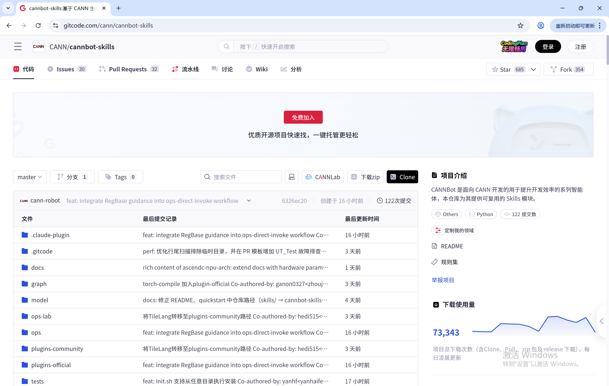

> 💡 **小贴士**：建议收藏该页面，这是 CANNBot 社区的核心仓库，后续技能更新和社区讨论都会在这里进行。


### Step 2：登录 GitCode，Star 并 Fork 仓库（*重要*）

点击页面中的【免费加入】红色按钮，使用微信扫一扫快速完成登录/注册。


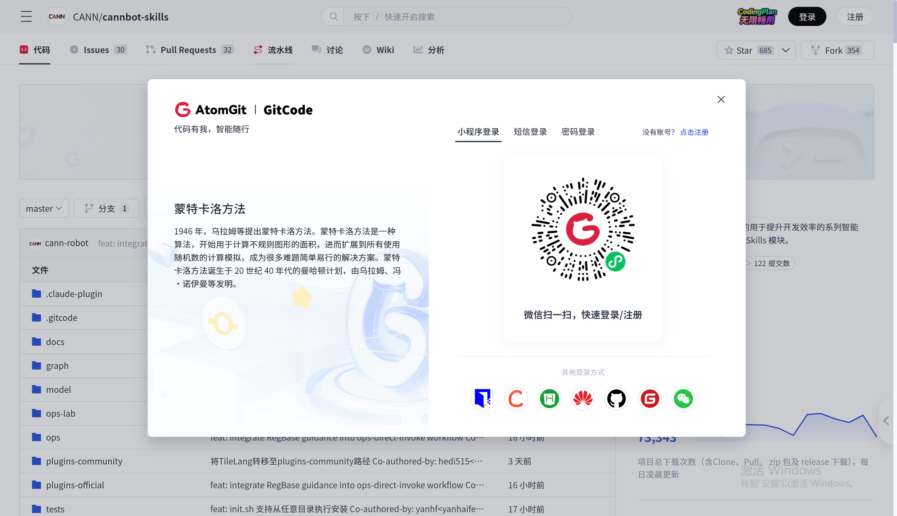

登录成功后，在 CANN/cannbot-skills 仓库首页右上方，依次点击【Star】⭐ 和【Fork】 按钮。


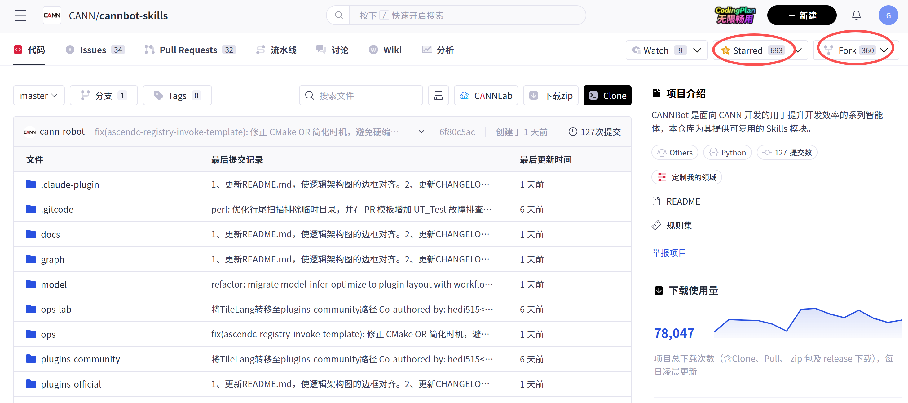

> 💡 **小贴士**：Star 仓库可以收藏并关注 CANNBot 的最新动态；Fork 仓库会将项目复制到你的个人账号下，后续在 CANNLab 中的代码修改和技能开发都将基于你 Fork 后的仓库进行。


### Step 3：进入 CANNLab 开发平台

在仓库页面找到并点击【CANNLab】按钮。


此时会弹出华为云一站式算子开发平台的欢迎页面。如果你已有华为云实名认证账号，可直接点击【直接进入】；如果没有，请继续阅读「第二阶段」完成认证。


## 第二阶段：完成华为云实名认证（仅需 1 分钟，如已有实名认证账户则跳过该步骤）

根据国家法规要求，使用云算力资源必须完成实名认证。首次访问 CANNLab 时，需要进行华为云账号绑定和实名认证。


### Step 4：签署开发者协议

在欢迎页面勾选《华为云开发者服务协议》等相关协议，点击【进入】。


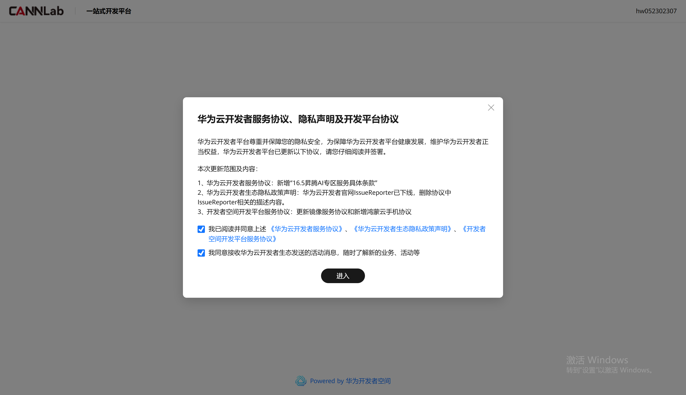


### Step 5：开始实名认证

如果系统提示「创建开发环境需要先进行实名认证」，点击【立即认证】。


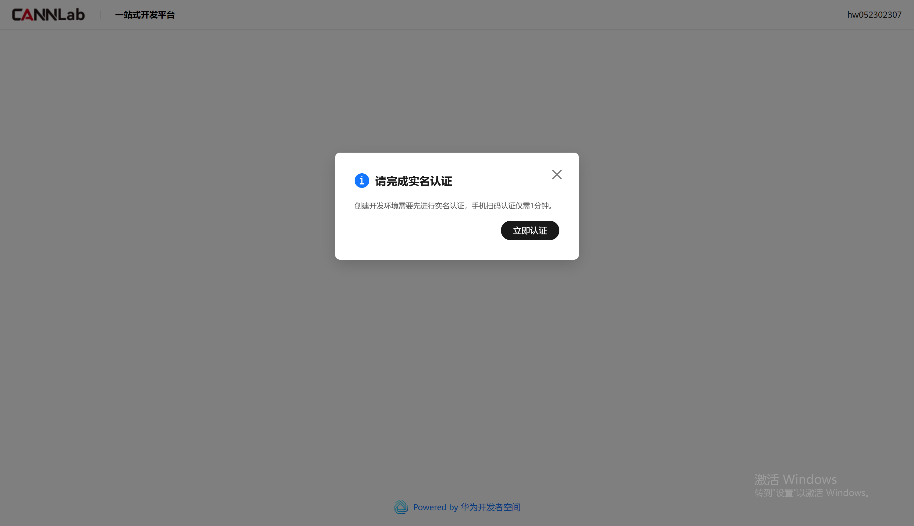


### Step 6：选择个人认证

页面跳转至华为云控制台「实名认证」页面，选择【个人认证】。


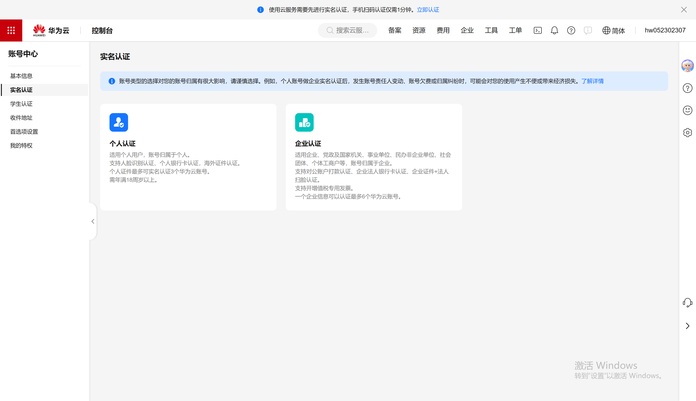


### Step 7：点击立即认证，手机扫码完成实名认证

在认证页面，点击图片正中间上方的【立即认证】按钮，使用手机扫码完成实名认证。


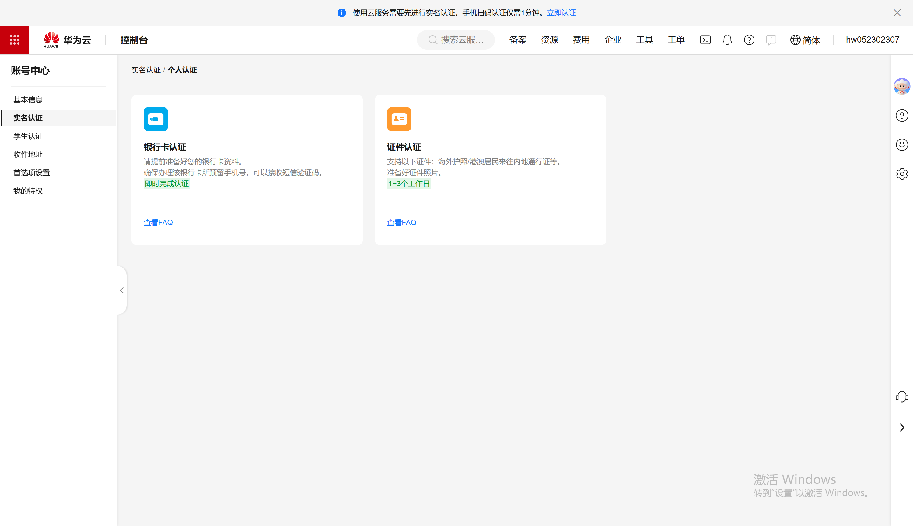

> 💡 **小贴士**：手机扫码认证方式操作简单快捷，只需跟随页面引导即可完成。如果扫码认证遇到问题，也可选择其他认证方式，如「银行卡认证」、「证件认证」。


### Step 8：认证成功

认证通过后，页面会显示「个人认证成功」及你的认证信息。


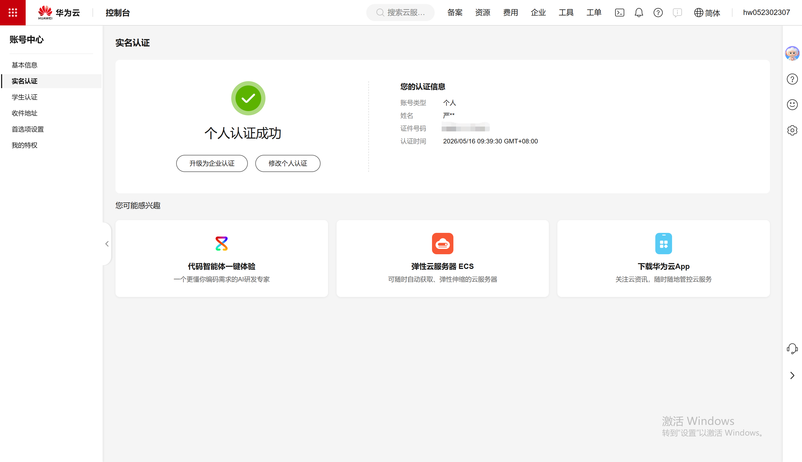


## 第三阶段：创建 NPU 开发环境


### Step 9：返回 CANNLab 并直接进入

实名认证完成后，回到 GitCode 的 CANNBot 仓库页面，重新点击【CANNLab】→【直接进入】。


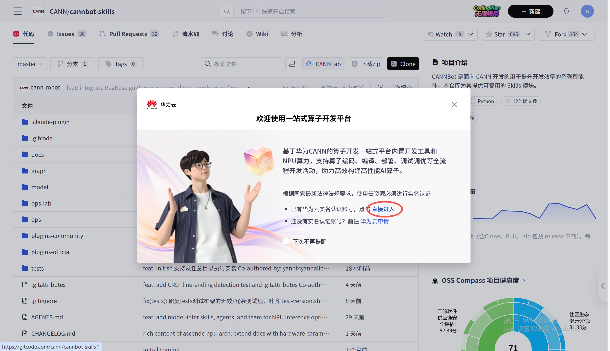


### Step 10：进入云开发环境页面

成功进入 CANNLab 的「云开发环境」页面。首次进入时环境列表为空，点击【创建 NPU 环境】。


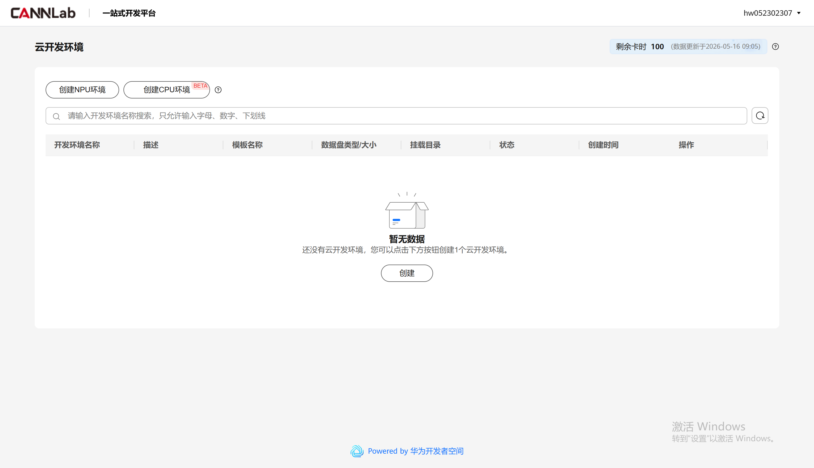


### Step 11：完成 GitCode 账号授权

首次创建环境时，系统会弹出提示，需要完成 GitCode 账号授权。点击【立即授权】。


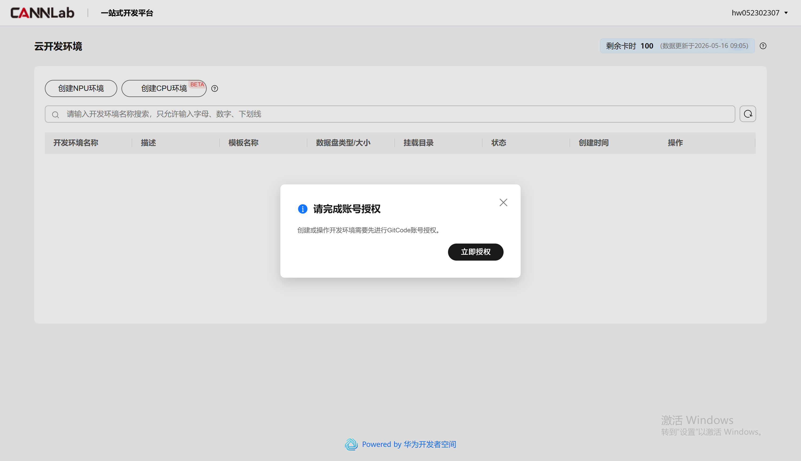

> 💡 **小贴士**：授权是为了让云端开发环境能够访问你的 GitCode 仓库代码，实现云端开发与代码托管的无缝衔接。


### Step 12：确认授权

页面跳转至 GitCode 授权页面，确认应用权限后点击【授权】。


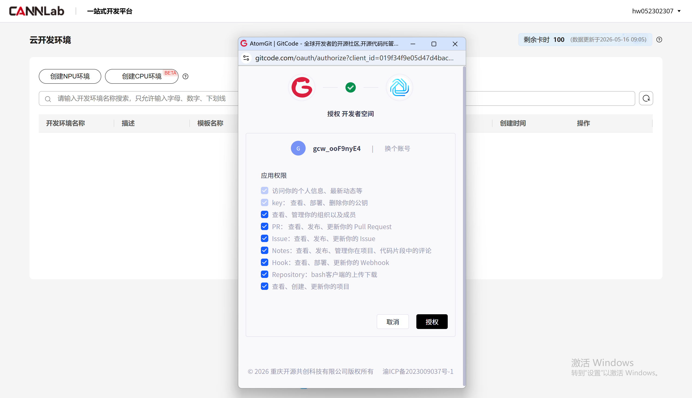


### Step 13：创建开发环境

授权完成后返回云开发环境页面，再次点击【创建 NPU 环境】。在弹出的配置窗口中，系统已自动填充默认配置（预置 CANN 开发镜像和 NPU 规格），直接点击【创建】即可。


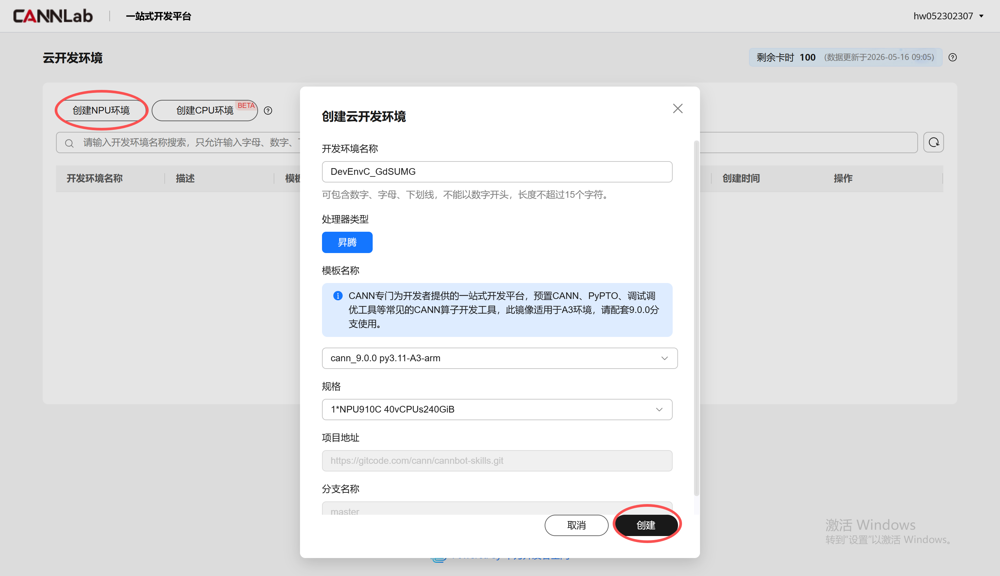

> 💡 **小贴士**：默认配置已为你预装好 CANN、PyPTO 等常见开发工具，镜像为 cann_9.0.0 py3.11-A3-arm，规格为 1*NPU910C 40vCPUs 240GiB，无需修改即可满足大多数算子开发需求。


### Step 14：等待环境启动

创建成功后，环境列表中会出现新环境，状态显示为「开机中」。请耐心等待约 20 秒，直至状态变为「运行中」。


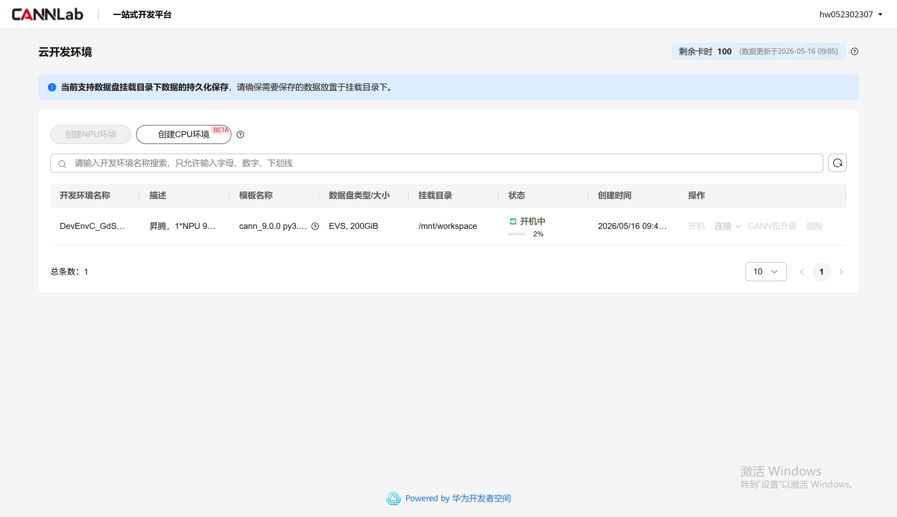

> ⚠️ **注意**：如果环境长时间停留在「开机中」，请尝试刷新页面或检查网络连接。


### Step 15：连接 WebIDE

当环境状态变为「运行中」后，点击操作列的【连接】下拉按钮，选择【WebIDE】。


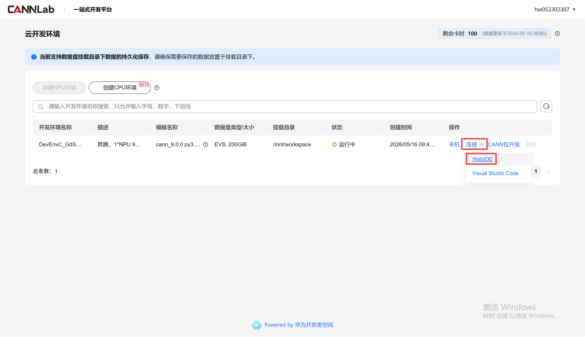


### Step 16：开始你的算子开发之旅！

成功进入 CANNLab WebIDE 界面，左侧资源管理器已自动加载 cannbot-skills 项目代码。现在你可以开始浏览、编辑和运行算子代码了！


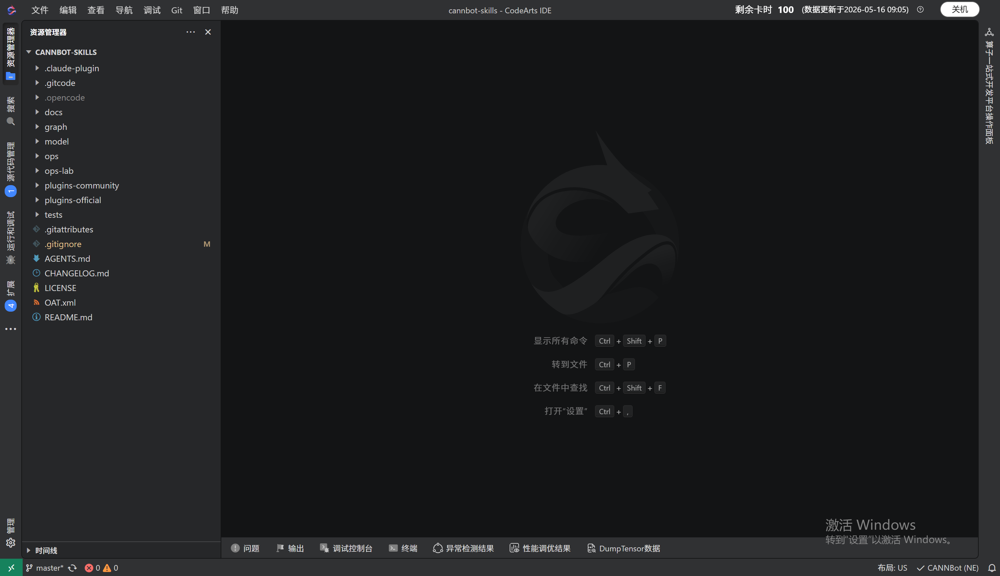


## 第四阶段：跑通你的第一个算子

环境已就绪，接下来通过 AscendC 直调（ops-direct-invoke）场景，体验 CANNBot 如何辅助你完成算子开发。只需输入自然语言需求，CANNBot 即可自动完成设计、编码、调试全流程。


### Step 17：打开终端并进入直调算子目录

在 WebIDE 底部点击【终端】标签打开终端，执行以下命令进入 AscendC 直调算子目录：


```bash
cd plugins-official/ops-direct-invoke/
```


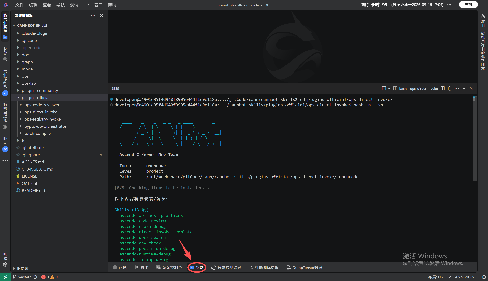


### Step 18：一键初始化开发环境

在终端中执行 init.sh 脚本，自动安装 CANNBot 所需的 skills、agents 等依赖组件：


```bash
bash init.sh
```


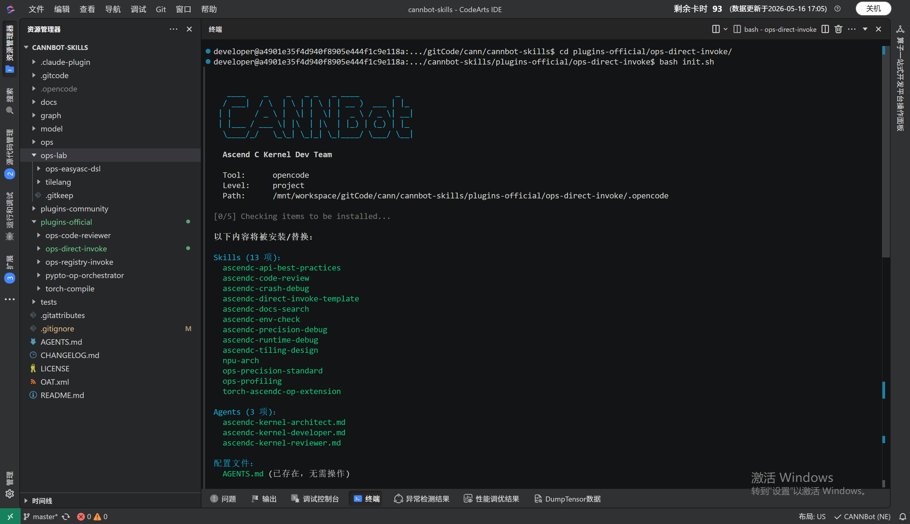

> 💡 **小贴士**：init.sh 会自动检测并安装 13 项 AscendC 相关技能（如 ascendc-api-best-practices、ascendc-direct-invoke-template 等），整个过程约 5 秒，无需手动配置。


### Step 19：启动 opencode 并描述算子需求

初始化完成后，启动 opencode 交互式开发助手：


```bash
opencode
```

启动后，OpenCode 将默认使用免费模型。在 opencode 输入框中用自然语言描述你的第一个算子需求，例如：


```bash
帮我开发一个 abs 算子，支持 float16 数据类型，shape 主要是 [1,128]、[4,2048]、[32,4096]
```


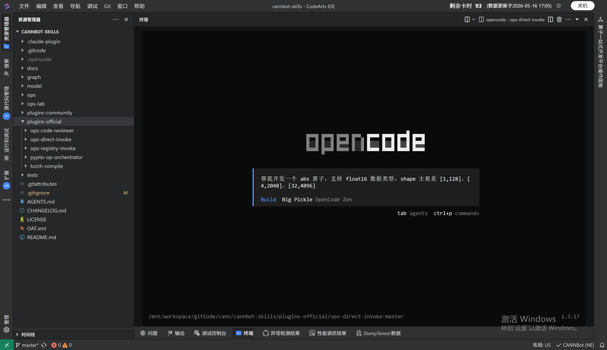


### Step 20：等待 CANNBot 自动完成算子开发

输入需求后，CANNBot 会自动加载 AscendC 直调算子开发工作流，按照「环境检查 → 设计 → 开发 → 审查 → 性能验收」的标准化步骤自动推进。


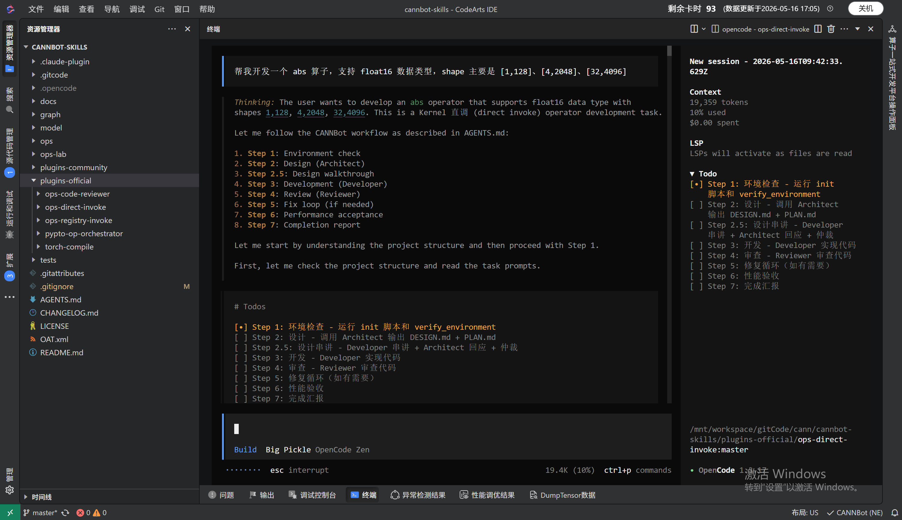

> ⚠️ **注意**：整个生成过程通常需要几十分钟，请保持终端窗口打开耐心等待。生成过程中可能会有弹窗提示权限操作确认，点击「允许」即可。


## 🎉 恭喜！全流程体验完成

你已经成功完成了从注册、认证、创建环境到跑通第一个算子开发的完整流程。接下来可以：

- 查看项目 README.md 和 quickstart.md，深入了解 CANNBot 的更多使用场景；
- 进入 plugins-official/ 目录，探索 ops-registry-invoke、ops-code-reviewer 等更多官方插件；
- 关注社区 Issues 和 Pull Requests，参与技能贡献与讨论。


## ❓ 常见问题 FAQ


**Q1：实名认证必须完成吗？**

A：是的。根据国家法律法规要求，使用云算力资源必须进行实名认证，这是保障云资源安全合规使用的必要步骤。


**Q2：可以创建多个 NPU 环境吗？**

A：每位开发者有固定的算力卡时配额（页面右上角显示「剩余卡时」），请在配额范围内合理创建和使用环境。


**Q3：代码和数据会丢失吗？**

A：挂载目录 /mnt/workspace 下的数据会持久化保存。建议将重要代码和数据存放在该目录下，以确保环境重启后数据不丢失。


**Q4：如何切换 opencode 使用的模型？**

A：在 opencode 交互界面中输入 /model 命令，即可打开模型选择列表，自由切换免费模型或配置自费模型 API Key。

> 💡 **小贴士**：如果你想切换其他模型，可在 opencode 中输入 /model 命令，选择其他免费模型或自费模型。更多配置可参考 opencode 官方文档：https://opencode.ai/docs/zh-cn/models/

### 示例：opencode 配置 GLM-5 模型

启动 opencode：


```bash
opencode
```

启动成功后，在输入框中输入以下命令连接阿里百炼（Alibaba China）：


```bash
/connect
```

在弹出的模型提供商列表中，搜索并选择：


```bash
Alibaba (China)
```


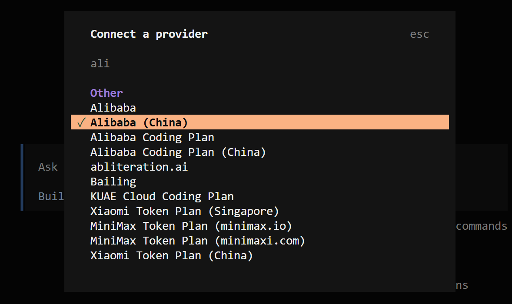

出现 API Key 输入框时，将你的的 sk- 密钥粘贴到输入框中并确认。


```bash
sk-63axxxxxxxxxx
```

接着在模型列表中搜索并选择：


```bash
GLM-5
```


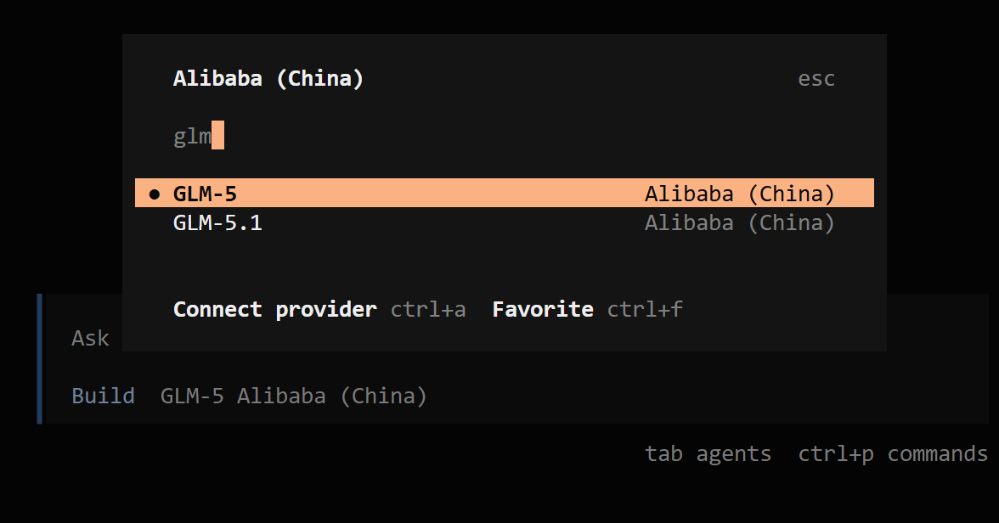
