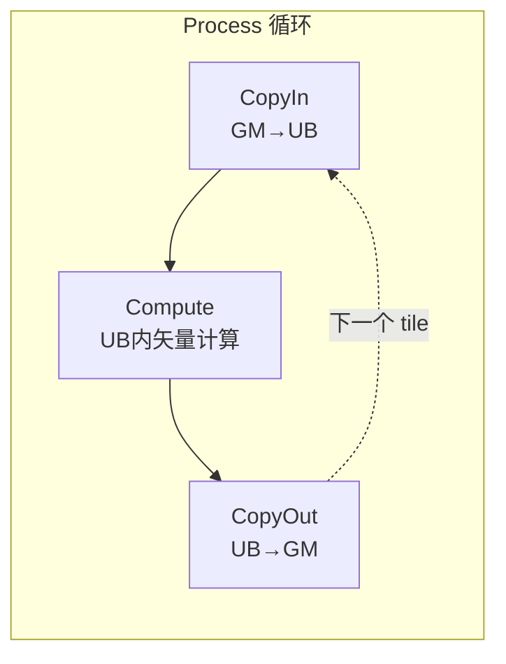
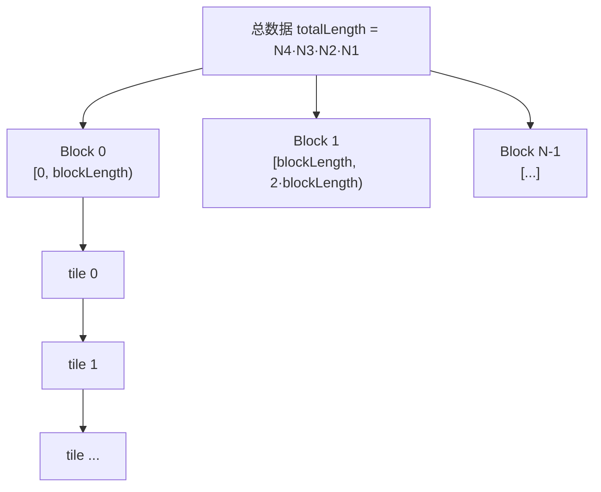

# atanh 算子（AscendC 框架）实现说明

> 反双曲正切（Inverse Hyperbolic Tangent）逐元素算子，基于华为昇腾 **AscendC** 框架实现。

---

## 目录

- [1. 算子规格](#1-算子规格)
- [2. 数学原理](#2-数学原理)
- [3. 工程结构](#3-工程结构)
- [4. 核心代码解析](#4-核心代码解析)
  - [4.1 Host 侧：算子原型 + Tiling](#41-host-侧算子原型--tiling)
  - [4.2 Kernel 侧：五段式流水线](#42-kernel-侧五段式流水线)
  - [4.3 精度策略：float32 中间计算](#43-精度策略float32-中间计算)
- [5. 数据分片与并行策略](#5-数据分片与并行策略)
- [6. 边界处理（非对齐尾块）](#6-边界处理非对齐尾块)
- [7. 编译与运行](#7-编译与运行)
- [8. 精度分析](#8-精度分析)
- [9. 术语表](#9-术语表)

---

## 1. 算子规格

| 项目 | 说明 |
| --- | --- |
| 算子名 | `AtanhCustom`（核函数名 `atanh_custom`） |
| 输入 | 1 个：`x`，shape `[N4, N3, N2, N1]`（4 维） |
| 输出 | 1 个：`y`，与输入同 shape |
| 数据类型 | `float16`（half） |
| 数据格式 | `FORMAT_ND`（标准稠密布局） |
| 计算式 | `y = atanh(x) = 0.5 · ln((1+x)/(1-x))` |
| 定义域 | `-1 < x < 1`（实数域） |
| 开发框架 | AscendC（CANN 7.x / 8.x） |

---

## 2. 数学原理

反双曲正切是双曲正切 `tanh` 的反函数：

$$
\operatorname{atanh}(x) = \frac{1}{2}\ln\left(\frac{1+x}{1-x}\right), \quad x \in (-1, 1)
$$

推导过程：令 $y = \operatorname{atanh}(x)$，则 $x = \tanh(y) = \dfrac{e^{y}-e^{-y}}{e^{y}+e^{-y}}$，两边同乘 $e^y$ 得 $x = \dfrac{e^{2y}-1}{e^{2y}+1}$，解得 $e^{2y} = \dfrac{1+x}{1-x}$，故 $y = \dfrac{1}{2}\ln\dfrac{1+x}{1-x}$。

**边界行为**（与 C 标准库 `std::atanh` / IEEE 语义一致）：

| 输入 x | 输出 atanh(x) |
| --- | --- |
| `x = 0` | `0` |
| `x → 1⁻` | `+∞` |
| `x → -1⁺` | `-∞` |
| `|x| > 1` | `NaN` |

本实现不做显式定义域裁剪（与框架原生算子语义一致），输入越界时 `1-x ≤ 0`，`Div`/`Ln` 会自然产生 `Inf` 或 `NaN`。

---

## 3. 工程结构

```
atanh_custom/
├── CMakeLists.txt                 # 构建脚本
├── build.sh                       # 一键编译脚本（算子库 + 测试程序）
├── run.sh                         # 一键运行验证脚本（生成数据→执行→对比）
├── op_host/                       # Host 侧（运行在 CPU）
│   ├── atanh_custom_tiling.h      # Tiling 数据结构定义
│   └── atanh_custom.cpp           # 算子原型注册 + TilingFunc
├── op_kernel/                     # Kernel 侧（运行在 NPU AICore/AIV）
│   └── atanh_custom.cpp           # 核函数实现
└── testcase/                      # 运行验证配套文件
    ├── main.cpp                   # Host 侧调用程序（aclnn 单算子 API）
    ├── gen_data.py                # 生成测试数据 + 真值
    └── verify_result.py           # 精度对比
```

**Host 与 Kernel 的职责分工**：


---

## 4. 核心代码解析

### 4.1 Host 侧：算子原型 + Tiling

**算子原型**（`OP_ADD` 注册）：声明 1 输入 1 输出、`DT_FLOAT16`、`FORMAT_ND`，并绑定 Tiling 函数与芯片型号。

```cpp
namespace ops {
class AtanhCustom : public OpDef {
public:
    explicit AtanhCustom(const char* name) : OpDef(name) {
        this->Input("x").ParamType(REQUIRED)
            .DataType({ge::DT_FLOAT16}).Format({ge::FORMAT_ND});
        this->Output("y").ParamType(REQUIRED)
            .DataType({ge::DT_FLOAT16}).Format({ge::FORMAT_ND});
        this->SetInferShape(ge::InferShape);
        this->SetInferDataType(ge::InferDataType);
        this->AICore().SetTiling(optiling::TilingFunc);
        this->AICore().AddConfig("ascend910b");
    }
};
OP_ADD(AtanhCustom);
}
```

**TilingFunc**：负责把总数据切分到「多核 × 多 tile」两级并行粒度。

1. `GetCoreNumAiv()` 获取 Vector 核数，作为 `blockDim`；
2. 遍历 shape 各维求积得到 `totalLength`（ND 连续存储，逐元素算子只看长度）；
3. `blockLength = ceil(totalLength / aivNum)`，每核一份；
4. 根据 UB 大小反推 `tileLength`（每元素含双缓冲开销 32 字节），并向上对齐到 256。

### 4.2 Kernel 侧：五段式流水线

标准 AscendC 矢量编程范式，`Init` 分配资源、`Process` 调度三级流水：



- **CopyIn**：`DataCopy` 把 `x` 从 GM 搬入 UB 输入队列；
- **Compute**：`DeQue` 取数据，用 `Cast / Adds / Muls / Div / Ln` 组合完成 atanh；
- **CopyOut**：`DataCopy` 把结果写回 GM 输出。

### 4.3 精度策略：float32 中间计算

`float16` 只有约 3 位十进制有效数字，直接用 half 做 `Ln/Div` 会在 `|x|→1` 时产生较大误差。因此：

```cpp
Cast(tmp1, xLocal, RoundMode::CAST_NONE, len);   // half → float32（无损失）
/* ... 全部在 float32 中计算 ... */
Cast(yLocal, tmp2, RoundMode::CAST_ROUND, len);  // float32 → half（四舍五入）
```

| 转换方向 | RoundMode | 原因 |
| --- | --- | --- |
| half → float32 | `CAST_NONE` | 低精度→高精度，无精度损失，不需舍入 |
| float32 → half | `CAST_ROUND` | 高精度→低精度，需四舍五入 |

---

## 5. 数据分片与并行策略

两级并行：

1. **核间并行（block 级）**：`blockDim = AIV 核数`，每个核处理 `[start, start+myLen)` 区间；
2. **核内流水（tile 级）**：每核数据再切成多个 `tileLength` 大小的 tile，配合 **双缓冲（BUFFER_NUM=2）** 让拷贝与计算重叠。



---

## 6. 边界处理（非对齐尾块）

`DataCopy` 的搬运粒度为 32 字节，对 `half` 要求长度是 16 的整数倍。真实 shape 不一定满足对齐，此时尾块用 **`DataCopyPad`** 让硬件自动补齐：

```cpp
if (len == tileLength) {
    DataCopy(xLocal, xGm[offset], tileLength);      // 对齐主体
} else {
    DataCopyExtParams copyParams;
    copyParams.blockCount = 1;
    copyParams.blockLen = len * sizeof(half);       // 字节数，可非对齐
    copyParams.srcStride = 0;
    copyParams.dstStride = 0;
    copyParams.rsv = 0;
    DataCopyPadExtParams padParams;                 // isPad=false, 默认补 dummy
    padParams.isPad = false;
    // ...
    DataCopyPad(xLocal, xGm[offset], copyParams, padParams);  // 尾块路径
}
```

> 关键约束：`blockLen` 须为 `sizeof(half)` 的整数倍（2 字节）；`leftPadding/rightPadding` 单位是元素个数且不超过 32 字节；UB↔GM 方向 stride 单位不同（GM 侧字节、UB 侧 dataBlock 32B），单块搬运时置 0 即可。

---

## 7. 编译与运行

### 7.1 一键编译（build.sh）

```bash
# 用法：bash build.sh [SOC_VERSION] [RUN_MODE]
# 默认 SOC_VERSION=ascend910b，RUN_MODE=npu
bash build.sh
# 指定芯片型号：
bash build.sh ascend310p npu
```

脚本完成两件事：

1. **编译算子库**：`cmake` + `make` 编译 `op_host` 与 `op_kernel`，产物为算子动态库（`.so`）；
2. **编译测试程序**：用 `g++` 编译 `testcase/main.cpp`，链接 `libascendcl` 与 `libcust_opapi`，产物为 `build/main`。

> 环境要求：已安装 CANN 工具包并设置 `ASCEND_CANN_PACKAGE_PATH`。脚本会自动 `source` CANN 的 `set_env` 脚本。

### 7.2 一键运行验证（run.sh）

```bash
# 用法：bash run.sh [N4 N3 N2 N1]
# 默认 shape = [2, 3, 4, 5]
bash run.sh
# 指定 4 维 shape：
bash run.sh 2 4 6 8
```

脚本串联完整验证链路：


- **gen_data.py**：在 `(-0.99, 0.99)` 区间生成 float16 输入（避开 atanh 边界），并用 numpy 计算 float32 真值；
- **main.cpp**：通过 aclnn 两段式接口 `aclnnAtanhCustomGetWorkspaceSize` + `aclnnAtanhCustom` 调用算子；
- **verify_result.py**：对比输出与真值，输出最大绝对/相对误差（阈值 1e-3）。

### 7.3 手动 CMake 构建（可选）

```bash
export ASCEND_CANN_PACKAGE_PATH=/usr/local/Ascend/ascend-toolkit/latest
mkdir build && cd build
cmake .. -DSOC_VERSION=ascend910b -DRUN_MODE=npu
make -j
```

> 推荐优先使用 `msopgen gen` 生成标准算子工程骨架（类型名大驼峰 `AtanhCustom`），再把本工程的 `op_host/`、`op_kernel/` 替换进去，标准工程会自带完整的部署（算子包安装）与 aclnn 接口生成逻辑。

### 7.4 关键注意点

| 项目 | 说明 |
| --- | --- |
| aclnn 接口生成 | 算子库**部署**后才会生成 `aclnn_atanh_custom.h` 与两段式接口，需先 `make install` 或按官方流程安装算子包 |
| aclnn 两段式签名 | 不同 CANN 版本签名略有差异（workspace/stream/executor 参数顺序），请以实际生成的 `aclnn_atanh_custom.h` 为准 |
| 库路径 | `libascendcl`（新版）与 `libacl`（旧版）库名不同，脚本默认用 `-lascendcl`，按环境调整 |
| 芯片型号 | `AddConfig("ascend910b")` 与 `build.sh` 的 `SOC_VERSION` 需与实际硬件一致 |

---

## 8. 精度分析

| 方案 | 相对误差 | 说明 |
| --- | --- | --- |
| half 全程计算 | ~1e-2 量级 | 精度差，`|x|→1` 时恶化明显 |
| **float32 中间计算（本实现）** | ~1e-4 量级 | 仅首尾各一次类型转换损失 |

实测建议：在 `(-0.99, 0.99)` 区间与 `std::atanh` 对比，双精度参考下误差应稳定在 half 的量化误差附近（约 4.9e-4）。

---

## 9. 术语表

| 术语 | 英文 | 说明 |
| --- | --- | --- |
| 反双曲正切 | atanh / Inverse Hyperbolic Tangent | tanh 的反函数 |
| 统一缓冲区 | UB（Unified Buffer） | AICore 片上缓存，向量计算数据载体 |
| 全局内存 | GM（Global Memory） | Device 端大容量显存 |
| 分片 | Tiling | 将大张量按核/块切分的策略 |
| 双缓冲 | Double Buffer | 拷贝与计算重叠的流水线技术 |
| AIV | AI Vector Core | 昇腾向量计算核 |
| 逐元素算子 | Element-wise Op | 每个元素独立运算，无跨元素依赖 |
| ND 格式 | FORMAT_ND | 标准多维稠密内存布局 |
